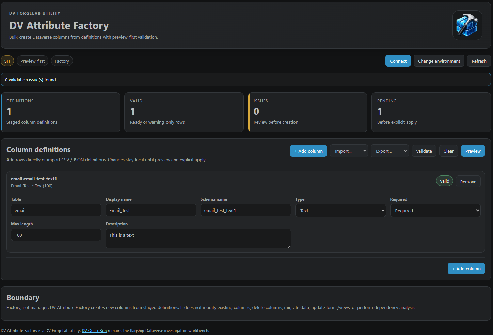

# DV Attribute Factory

Bulk-create Dataverse columns inside VS Code.

**DV Attribute Factory** is a focused DV ForgeLab utility for creating new Dataverse columns from staged definitions with validation, preview, execution reporting, and explicit publish semantics.

## Highlights

- Webview-based column factory experience
- CSV import and export
- JSON import and export
- CSV template generation
- Preview-first metadata mutation workflow
- Environment-aware safety indicators
- Explicit apply and publish semantics
- Existing column detection
- Duplicate definition detection and merge handling
- Validation before Dataverse mutation
- Execution reporting with Created, Skipped, and Failed outcomes
- Shared DV ForgeLab Dataverse environment settings
- DV Quick Run rich `.dvaf.json` reconstruction artifact import
- Lookup column reconstruction support for DVQR-rich reconstruction exports
- Relationship-aware lookup creation using Dataverse metadata APIs
- Choice reconstruction support from DVQR-rich reconstruction exports

## Screenshot



DV Attribute Factory running inside VS Code with staged column definitions, validation status, environment-aware safety indicators, and preview-first metadata creation workflows.

## Preview-first workflow

```text
Connect
↓
Add or import column definitions
↓
Validate
↓
Preview
↓
Create attributes
↓
Review execution report
```

## Supported column types

### Supported in v1.1.0

- Text
- Multiline Text
- Whole Number
- Decimal
- Currency
- Date Only
- Date and Time
- Yes/No
- Choice
- Lookup (DVQR-rich reconstruction artifacts)

### Lookup support in v1.1.0

Lookup columns are supported when imported from DV Quick Run rich `.dvaf.json`
reconstruction artifacts.

DVAF creates the required Dataverse relationship metadata and lookup column
using captured reconstruction metadata.

Flat CSV/JSON lookup rows remain review-only unless sufficient relationship
metadata is available.

All lookup reconstruction remains preview-first and requires explicit user
confirmation before execution.

## Scope

DV Attribute Factory is intentionally a factory, not an attribute manager.

Included:

- Create new Dataverse metadata definitions
- Create lookup relationships required for supported lookup reconstruction
- Validate staged definitions
- Import and export definitions
- Preview before Dataverse mutation
- Publish affected tables after creation
- Review execution results

Excluded:

- Modify existing columns
- Delete columns
- Change column types
- Migrate data
- Update forms
- Update views
- Dependency analysis
- Relationship creation outside DVQR-rich lookup reconstruction
- Security configuration
- Automatic metadata remediation

## Boundary

DV Attribute Factory creates new Dataverse columns from staged definitions.

It does not:

- Modify existing columns
- Delete columns
- Change column types
- Migrate data
- Update forms
- Update views
- Perform dependency analysis
- Create arbitrary relationships
- Create relationships outside DVQR-rich lookup reconstruction
- Modify existing relationships
- Manage security configuration

## Shared DV ForgeLab environment settings

```json
"dvForgeLab.environments": [
  {
    "name": "DEV",
    "url": "https://org.crm6.dynamics.com",
    "tenantId": "optional-tenant-id"
  }
]
```

## Command

```text
DV Attribute Factory: Open Attribute Factory
```

## Feedback

DV Attribute Factory includes direct integration with the DV ForgeLab feedback portal.

Share:

* Feature requests
* Bug reports
* Metadata reconstruction scenarios
* Workflow suggestions
* Product feedback

Feedback is routed through the shared DV ForgeLab feedback experience and automatically identifies DV Attribute Factory as the source product.

https://www.dvforgelab.com/feedback

## Philosophy

DV Attribute Factory follows the DV ForgeLab preview-first invariant.

Metadata changes are staged locally, validated, previewed, and explicitly applied by the user. Dataverse metadata is never changed without an explicit preview and confirmation step.

## Reconstruction Boundaries

DV Attribute Factory reconstructs supported metadata.

DV Attribute Factory does not manage existing metadata and does not
attempt automatic remediation.

Global choice lifecycle management remains the responsibility of
DV Choice Editor.

DVAF may reconstruct choice columns from captured option values,
but does not create or manage reusable global choice definitions.

DV Quick Run investigates and exports reconstruction intent.
DV Attribute Factory previews and creates supported metadata.
Human review remains required.

### DV Quick Run Integration

DV Attribute Factory supports reconstruction artifacts generated by
DV Quick Run.

Current workflow:

```text
DV Quick Run
    ↓
Cross Diff / Timeline Reconstruction
    ↓
Export DVAF Artifact
    ↓
DV Attribute Factory
    ↓
Preview
    ↓
Create Supported Metadata
```

Supported reconstruction metadata:

- Text
- Numeric
- Date
- Choice
- Lookup

Future releases will expand reconstruction support through the wider
DV ForgeLab ecosystem, including DV Choice Editor and DV Identity Manager.

## Future Direction

DV Attribute Factory participates in the DV ForgeLab reconstruction workflow through DV Quick Run reconstruction artifacts.

## Part of the DV ForgeLab Family

DV Attribute Factory is a focused Dataverse utility from DV ForgeLab.

For operational investigation, execution, runtime analysis, and cross-environment comparison, see [DV Quick Run](https://www.dvquickrun.com).

DV Attribute Factory follows the same principles:

* Preview-first
* Environment-aware
* Metadata-backed
* Explicit execution
* Calm operational UX

---

Built by **[DV ForgeLab](https://www.dvforgelab.com)**.